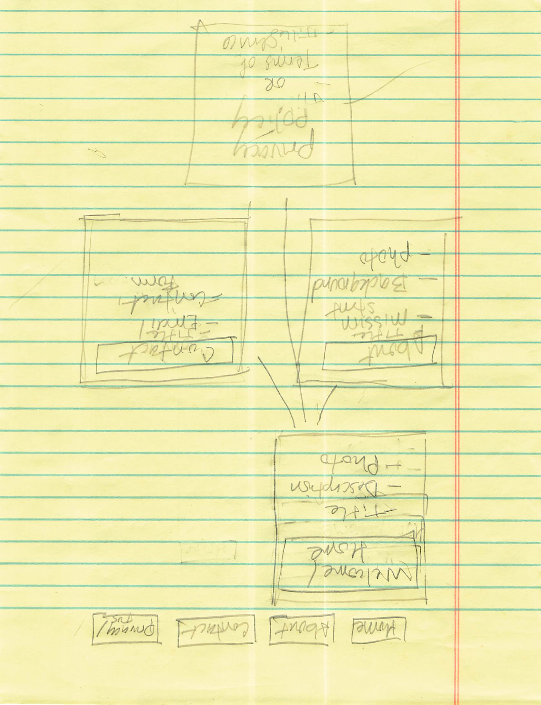
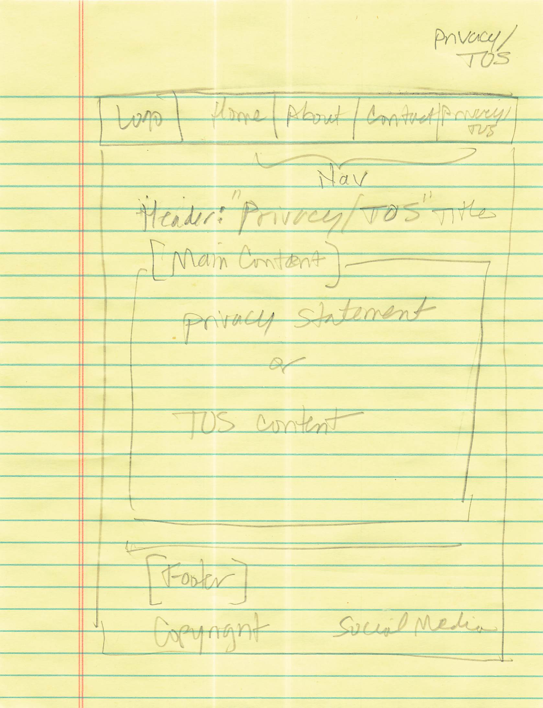

# Greg's INF 6420 Project
The purpose of this project is to develop and refine basic pages for a pre-existing *WordPress* site that highlights my personal archival collection. This site is **GRchive** and is located at https://www.grchive.net.
## Wireframes
### Skeleton Wireframe

Each page will contain a navgation menu (at top spanning all pages), header, content (page-specific), and a footer (with footer links spanning all pages).
### *Home* Wireframe

This wireframe is the *Home* page which serves as both welcome page and a landing page for the site. On my Wordpress site the landing page is the blog page but this can be changed if I can create a nice landing page.
Components specific to this page will include:
1. Navigation Menu
- *Home* Link/Button
- *About* Link/Button
- *Contact* Link/Button
- *Privacy* Link/Button
2. Header
3. Content
- Title
- *Welcome* Message
- Banner Photo
- Description
4. Footer
- Copyright
- Social Media Link(s)
### *About* Wireframe

This wireframe is for the *About* opage which will have informaion on why this site exists and who I am (to a certain point). 
Components specific to this page will include:
1. Navigation Menu
- *Home* Link/Button
- *About* Link/Button
- *Contact* Link/Button
- *Privacy* Link/Button
2. Header
3. Content
- Title
- Mission Statement
- Background
4. Footer
- Copyright
- Social Media Link(s)
### *Contact* Wireframe

Components specific to this page will include:
1. Navigation Menu
- *Home* Link/Button
- *About* Link/Button
- *Contact* Link/Button
- *Privacy* Link/Button
2. Header
3. Content
- Email
- Contact Form
4. Footer
- Copyright
- Social Media Link(s)
### *Privacy* Wireframe

Components specific to this page will include:
1. Navigation Menu
- *Home* Link/Button
- *About* Link/Button
- *Contact* Link/Button
- *Privacy* Link/Button
2. Header
3. Content
- Privacy Policy
- Terms of Service (TOS)
4. Footer
- Copyright
- Social Media Link(s)

[*Read Me* file updated 5/15/2025]
